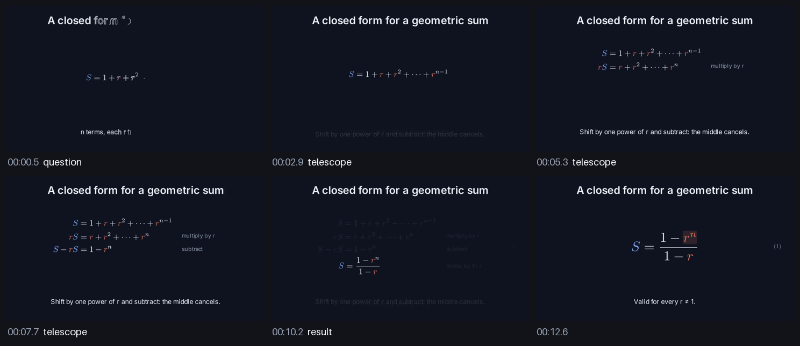

# Manim Director

Manim Director is a Claude Code and Codex plugin, plus a local engine, for authoring math-heavy
[Manim Community](https://www.manim.community/) animations. Scenes stay ordinary Manim code; a
math-first layer, `DirectedScene`, handles stepwise derivations, symbol colors, layout and beats. The
engine renders scenes, makes stills and contact sheets, checks rendered frames, checks the algebra and
explains failures with `file:line` findings. Your agent drives it through MCP; you can watch and edit
in a local workbench.

## Write the mathematics

```python
from manim import *
from manim_director_runtime import DirectedScene


class GeometricSum(DirectedScene):
    symbols = {"S": "primary", "r": "accent"}  # every S and r, in every formula

    def construct(self):
        total = self.math(r"S = 1 + r + r^2 + \cdots + r^{n-1}")
        with self.beat("question", transition="reveal"):
            self.title("A closed form for a geometric sum")
            self.place(total)
            self.caption("n terms, each r times the one before.")

        with self.beat("telescope"):
            self.caption("Shift by one power of r and subtract: the middle cancels.")
            steps = self.derive(
                r"S = 1 + r + r^2 + \cdots + r^{n-1}",
                (r"rS = r + r^2 + \cdots + r^n", "multiply by r"),
                (r"S - rS = 1 - r^n", "subtract"),
                (r"S = \frac{1 - r^n}{1 - r}", "divide by 1 - r"),
                replaces=total,
            )

        result = self.math(r"S = \frac{1 - r^n}{1 - r}", font_size=72)
        with self.beat("result"):
            self.place(result, replaces=steps.lines[-1])
            self.tag(result)
            self.caption("Valid for every r ≠ 1.")
        self.highlight(result, r"r^n", box=True)
        self.wait()
```

The contact sheet the engine makes of it:



What the scene gets from `DirectedScene`:

- **Symbols keep their color.** `math()` colors every `S` and `r` from the theme (per scene, or for
  the whole project through `direction.symbols` in `director.yaml`) and splits the TeX into atoms, so
  `TransformMatchingTex` carries matching terms from one step to the next.
- **Derivations are one call.** `derive()` writes the first step, then transforms each line into the
  next with the relations aligned and an optional note beside each; `in_place=True` rewrites a single
  line instead. `highlight()`, `term()` and `tag()` mark sub-terms and number equations.
- **Layout is checked, not hoped for.** `place()` fits objects into named regions (`header`,
  `content`, `left`, `right`, `top`, `bottom`, `caption`) inside the safe area. A placement that would
  overlap something raises a `CompositionError` naming the line, before anything moves.
- **Beats carry the story.** A beat changes the stage in one transition: objects that were not kept
  or placed again leave, replaced ones morph, new ones enter; the title and caption stay until a
  `chapter`. Each beat is also a Manim section and an entry in the render timeline, so contact sheets
  and QA findings name the beat and its line.
- **It is still Manim.** Helpers return ordinary mobjects, plain `self.play(...)` mixes in freely,
  and the `manim` command renders the scene without the engine.

Four themes ship, each checked for contrast and color-vision deficiencies: `midnight` (default),
`paper`, `chalkboard` and `contrast`. Pick one in `director.yaml` or per scene with `theme = "paper"`.

## Install

You need Python 3.11+ with `venv`, FFmpeg (`ffmpeg` and `ffprobe` on `PATH`), a TeX distribution
that includes `dvisvgm` (TeX Live, MacTeX or MiKTeX), and what pip needs to build Manim's Cairo and
Pango bindings. On Debian or Ubuntu:

```bash
sudo apt install python3-venv python3-dev build-essential pkg-config libcairo2-dev libpango1.0-dev \
  ffmpeg texlive-latex-base texlive-latex-extra texlive-fonts-recommended dvisvgm
```

On macOS, `brew install ffmpeg pkg-config cairo` and install MacTeX. Then:

```bash
git clone https://github.com/Cuuper22/Manim-plugin.git
cd Manim-plugin
python3 scripts/install.py --with-manim
```

On Windows, pip uses prebuilt Cairo and Pango bindings, so FFmpeg and MiKTeX are enough; run
`py -3 scripts\install.py --with-manim`. Claude Code starts the plugin's launcher with `python3`,
which the Python install manager and the Microsoft Store Python provide but the older python.org
installer does not.

The installer puts `manim-director` in `~/.local/bin` and Manim plus the runtime in their own virtual
environment under `~/.local/share/manim-director/venv`. Then add the plugin to your agent.

Claude Code:

```text
/plugin marketplace add Cuuper22/Manim-plugin
/plugin install manim-plugin@manim-director
```

Codex:

```bash
codex plugin marketplace add Cuuper22/Manim-plugin
codex plugin add manim-plugin@manim-director
```

Start a project and check the machine:

```bash
manim-director init my-film && cd my-film
manim-director doctor
```

Save the scene above as `scenes/sum.py`, render it and look at it:

```bash
manim-director render --scene GeometricSum --profile preview
manim-director contact-sheet --scene GeometricSum
manim-director qa --scene GeometricSum
~/.local/share/manim-director/venv/bin/manim -ql scenes/sum.py GeometricSum   # plain Manim
```

## Look before you ship

A render that exits cleanly can still be wrong, so every change goes through the same loop:

```bash
manim-director render --scene GeometricSum --profile draft     # fast, low resolution
manim-director still --scene GeometricSum                      # the last frame as PNG
manim-director frame --scene GeometricSum --at 7.5             # any moment of the latest render
manim-director contact-sheet --scene GeometricSum              # the whole scene at a glance
manim-director qa --scene GeometricSum                         # blank frames, contrast, safe area
manim-director validate-math "(1 - r^4)/(1 - r)" "1 + r + r^2 + r^3" --range r=-0.9:0.9
```

A failed render already carries its diagnosis; `manim-director diagnose --job <id>` repeats it, and
`diagnose --text` explains a pasted traceback or TeX log. Renders and stills are cached on the
content of the project files they can read, so an unchanged scene comes back at once.

## The workbench

```bash
manim-director open
```

`open` serves the workbench on `127.0.0.1:4177` and opens it already signed in. It lists the scenes
with their storyboard beats, plays the latest render of the selected scene over a beat timeline, and
shows the code editor next to the QA and doctor findings; a finding jumps to its file and line.
Buttons run a preview, a render at any profile, a still, the frame at the playhead, a contact sheet,
QA and exports. Jobs started from the CLI or by your agent appear live.

## With Claude Code and Codex

The plugin adds the `manim-director` skill and an MCP server with ten tools: `init`, `inspect`,
`doctor`, `render`, `still`, `contact_sheet`, `qa`, `validate_math`, `submit` (the other operations:
`frame`, `diagnose`, `captions`, `ingest`, `export`) and `job_status`. A job tool waits for its job
(20 seconds by default, up to 50), then answers with a bounded summary and the absolute paths of the
images and videos it made. Logs and media stay on disk; the agent opens the PNGs it needs.

Ask for what you want to see:

> Animate the derivation of the quadratic formula by completing the square, then show me a contact sheet.
>
> Why does `CompanionMatrix` fail to render?

In Claude Code the server starts through a small launcher. If the engine is not installed yet, it
offers a single `setup` tool that prints the install command. Codex runs `manim-director mcp`
directly, so install the engine first and make sure it is on `PATH`.

## Templates and the example

`manim-director init <dir> --template <name>` starts from a finished scene: `explainer` (geometric
series, picture then algebra), `derivation` (the quadratic formula), `geometry` (Pythagoras by
rearrangement), `graph` (secant to tangent) or `vertical_short` (a 9:16 Gauss sum).
`--scene-template <name>` adds one to an existing project.

[`examples/generalized-fibonacci`](examples/generalized-fibonacci) is a five-scene production of
`x[n+2] = p x[n+1] + q x[n]`: data charts from a CSV, the companion matrix with a camera close-up,
characteristic roots and a 3D orbit, with captions and narration timed to the beats.

## Documentation

- [Guide](docs/guide.md): projects, authoring with `DirectedScene`, the verify loop, the workbench.
- [Reference](docs/reference.md): CLI, `director.yaml`, MCP tools, HTTP API, bridge protocol, errors.
- [Security](docs/security.md): what the engine guards and what it cannot.
- [Architecture](docs/architecture.md): engine, runtime and workbench, and how a job flows.

## Development

```bash
make check                                         # every check CI runs
make dev PROJECT=examples/generalized-fibonacci    # engine plus the workbench with hot reload
python3 scripts/install.py --from-source --with-manim
```

`make check` needs Rust, Node 22 and a Python with `runtime[full,test]` installed (`PYTHON=...`).

Scene files are executable Python: render projects you trust, and untrusted ones in a container or VM.
See [docs/security.md](docs/security.md).

MIT © Cuuper22
