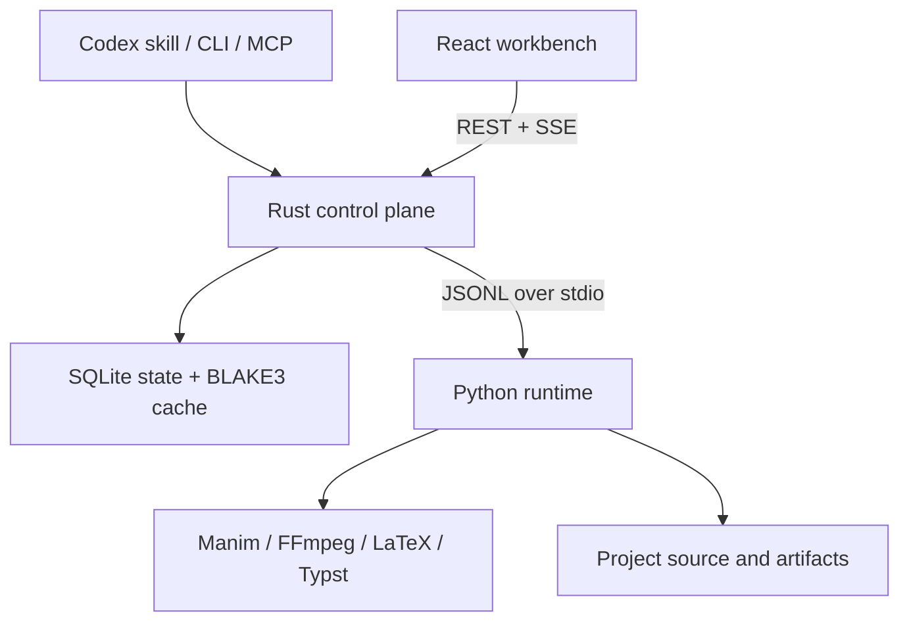
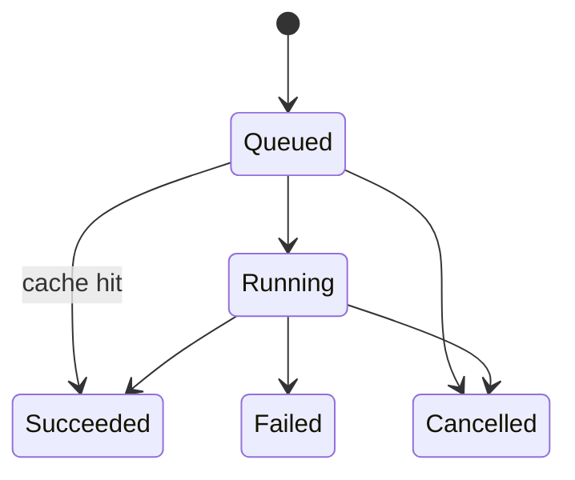

# Architecture

Manim Director splits orchestration from animation execution. A single Rust binary owns the CLI, local API, job lifecycle, cache, persistence, and MCP surface. A deliberately thin Python package performs operations that need the Python/Manim ecosystem. The React workbench is compiled to static files and served by the Rust process.

This split is the main performance decision: listing a project, opening the workbench, following a job, or asking for a cached result does not import Manim, NumPy, Pillow, or SymPy. Those libraries enter a process only when an operation needs them.

## Components



### Rust control plane

The Cargo workspace contains three crates:

| Crate | Responsibility |
|---|---|
| `manim-director-core` | Versioned project spec, shared job and protocol types, project discovery and inventory. |
| `manim-director-engine` | Python bridge, scheduler, BLAKE3 content cache, SQLite job/log store, local REST/SSE server, and MCP server. |
| `manim-director-cli` | The `manim-director` executable and user-facing commands. |

The binary is the only long-running coordinator. It assigns UUID job IDs, persists transitions, relays progress, applies cancellation, and converts each frontend into the same internal `JobRequest`. There is no second Node service and no separate database daemon.

### Python runtime

`runtime/src/manim_director_runtime` is an execution adapter, not another control plane. Its stable entry point is:

```bash
python -m manim_director_runtime bridge
```

It reads one JSON object per line from standard input and writes protocol messages to standard output. Diagnostics go to standard error. Operation modules are imported lazily; optional libraries remain unloaded for requests that do not need them.

The runtime currently implements the following canonical methods:

- `scaffold`, `ingest`, `discover`, `inspect`, and `doctor`
- `render`, `preview`, `still`, `section`, and `contact_sheet`
- `media`, `qa`, `diagnose`, and `math_validate`
- `captions`, `assets`, `export`, `sample`, `themes`, `templates`, and `capabilities`

The Rust `Operation` enum is the source of truth for the mapping between public operation names and runtime method names. `debug` maps to `diagnose`; `validate_math` maps to `math_validate`.

### Workbench

`workbench/` is a Vite/React/TypeScript application. Its production build is embedded into the release binary and calls the local `/api/*` routes; no adjacent Node installation or asset directory is required at runtime. It receives live state through `EventSource` rather than polling the entire workspace. The UI provides the project/asset browser, video preview, scene and beat timeline, object inspector, source editor, logs, render queue, and exports panel.

The browser never invokes Python or Manim directly. That keeps job ordering, cancellation, path handling, caching, and error normalization identical across the UI, CLI, and MCP.

### Codex plugin

The plugin manifest points Codex at the `manim-director` skill and local MCP server. The skill routes create, edit, explain, render, QA, debug, migrate, and export work while keeping media and raw logs out of the model context. The MCP layer intentionally exposes coarse operations; it does not mirror every internal function.

## Project model

A project is rooted by `director.yaml`. Commands invoked from a descendant directory walk upward until that file is found. This is a minimal valid version-1 spec:

```yaml
version: 1
project:
  name: Fibonacci Field Notes
  source_dir: scenes
  asset_dir: assets
  output_dir: output
  media_dir: .manim-director/media
render:
  renderer: cairo
  profile: preview
  format: mp4
  transparent: false
  width: 1920
  height: 1080
  fps: 60
theme:
  preset: midnight
  background: "#0B1020"
  foreground: "#F5F7FF"
  accent: "#69D2FF"
  font: Inter
safe_area:
  top: 0.05
  right: 0.05
  bottom: 0.08
  left: 0.05
captions:
  format: vtt
  burn_in: false
```

All four project directories must be relative paths without `..` components. The normal scaffold is:

```text
project/
├── director.yaml
├── manim.cfg
├── requirements.txt
├── scenes/
├── assets/
│   └── manifest.json
├── output/
└── .manim-director/
    ├── media/
    ├── tmp/
    ├── undo/
    └── state.db
```

`scenes/`, `assets/`, `director.yaml`, and other declared inputs are user-owned. `.manim-director/` is disposable generated state except while a job is running. `output/` contains deliverables and is excluded from fingerprints.

The schema also accepts structured brief, engine, inputs/provenance, storyboard, scene catalog, narration, audio/assets, named profiles, accessibility, validation, output, budget, extension, and forward-compatible extra fields. This lets a complete production spec coexist with the compact scaffold without forcing orchestration-only data into Python source.

## Job lifecycle

Every expensive or externally observable operation is a job:



The SQLite store uses WAL mode and persists jobs, structured logs, and cached results. On startup, jobs left in `queued` or `running` are marked failed with `engine_restarted`; a stale job is never presented as still active.

For a cacheable operation, the engine hashes:

1. a cache-schema marker;
2. the canonical runtime method;
3. canonicalized JSON parameters; and
4. relevant project input paths and bytes in sorted order.

The fingerprint includes source, vector/raster assets, data, math, text, audio, and font inputs. It deliberately ignores `.git`, virtual environments, `.manim-director`, `output`, build directories, and Python caches. A matching successful result creates a new succeeded job record with `cached: true`; callers therefore retain a complete audit trail without paying render cost twice.

Logs are cursor-paged, not returned wholesale. Job pages are capped at 200 items and log pages at 500 items by the store. This is both a UI responsiveness measure and a context-size boundary for agent use.

## Execution path

### CLI or MCP operation

1. The caller resolves or supplies a project root.
2. Rust validates the project spec and normalizes an `Operation` plus JSON parameters.
3. Cacheable input is fingerprinted. A cache hit terminates immediately.
4. The scheduler records and starts the job.
5. Rust writes one request to the Python bridge.
6. Runtime `event` messages become structured logs and engine progress events.
7. The terminal `result` or `error` updates SQLite, the cache when applicable, and subscribers.

### Workbench operation

1. The browser loads compact workspace state from `GET /api/state`.
2. An edit intent, render, cancellation, or export is posted to the matching REST route.
3. The server returns promptly with current state or a job identity.
4. `/api/events` streams changes; the client patches only the affected UI slice.
5. Large media stays addressable by path/URL and is not embedded into JSON.

### Cancellation

Cancellation is cooperative at the scheduler boundary and forcefully terminates the Python bridge when needed. The job moves to `cancelled`, the terminal state is persisted, and already valid intermediates are left available for a later run. Cancellation never rewrites source files.

## Data ownership and mutation

| Data | Owner | Mutation rule |
|---|---|---|
| `director.yaml` | User/project | Parsed and validated by Rust and Python; changed only by an explicit project edit. |
| Scene source | User/project | Scaffold creates it; later edits are revision-checked, validated, scoped, snapshotted, and atomic. |
| Assets and manifest | User/project | Asset operations normalize into the project and update metadata explicitly. |
| Job state and logs | Rust engine | Written transactionally to `.manim-director/state.db`. |
| Manim intermediates | Python/Manim | Written beneath the configured project media directory. |
| Final output | Runtime/exporter | Written beneath the configured output directory. |
| Browser state | Workbench | Ephemeral selection and view state; durable changes go through the source API. |

Python helpers use atomic replacement for generated text files. Rust source mutations additionally use BLAKE3 revisions, syntax/spec validation, and undo copies beneath `.manim-director/undo/`. Project inventory does not follow directory symlinks. The security boundary and limitations of executing user-authored Manim code are detailed in [security.md](security.md).

## Failure model

The system distinguishes four layers:

- **Protocol failure:** malformed JSONL, unknown method, invalid response, or bridge exit.
- **Project failure:** missing/invalid `director.yaml`, path escaping the root, missing scene, or invalid parameters.
- **Capability failure:** missing Manim, FFmpeg, LaTeX, Typst, font tooling, renderer, or codec.
- **Content/render failure:** Python traceback, TeX compilation error, media failure, timeout, cancellation, or QA finding.

Errors cross boundaries as a stable `{code, message, data?}` object. Human-readable diagnostics may be verbose on stderr or in log pages, but terminal API/MCP results stay compact.

## Platform model

- **Linux:** primary build and headless-render environment. Cairo is the predictable default. OpenGL needs a working display/EGL setup.
- **macOS:** native Rust and Python builds are supported. FFmpeg and LaTeX/Typst must be discoverable on `PATH`.
- **Windows:** native operation is supported; the installer uses the active Python launcher and Cargo toolchain. Paths are passed as structured arguments, never shell-concatenated. Long render paths should remain below legacy tool limits.
- **Containers/CI:** bind the project as a writable directory, keep the API on loopback unless the container boundary provides access control, and preinstall system render dependencies. The workbench needs no Node process after it has been built.

## Extension points

New capability should be added at the narrowest layer:

- A project-independent orchestration feature belongs in Rust.
- A Manim/media/math feature becomes a lazy Python operation and one `Operation` mapping.
- A visual interaction belongs in the React client and calls an existing or deliberately added REST contract.
- Agent-facing functionality is grouped into a coarse MCP tool instead of exposing low-level internals.

This keeps the steady-state engine small while retaining the full Python animation ecosystem behind a stable transport boundary.
