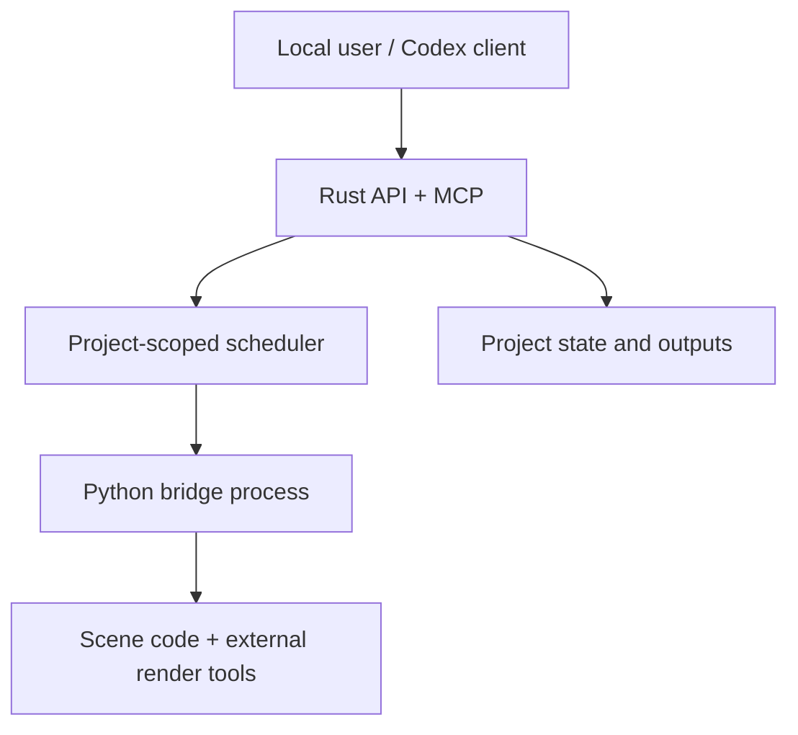

# Security model

Manim Director is a local developer tool for trusted projects. Its Rust API, MCP server, and Python bridge reduce accidental path and process hazards, but rendering a Manim scene executes Python. **The project source is code, not passive media, and the runtime is not a sandbox.**

That boundary determines the safe deployment model:

- Run projects you authored or reviewed under your normal user account.
- Keep the server on loopback unless another security boundary provides authentication and authorization.
- Use a container, VM, or disposable OS account for untrusted scene code.
- Do not expect path checks around Director-managed inputs/outputs to constrain arbitrary Python once Manim imports the scene.

## Trust boundaries

| Boundary | Trust assumption |
|---|---|
| CLI and stdio MCP caller | Same user and already authorized to operate on the project. |
| REST/SSE caller | Local workbench or explicitly trusted integration. There is no built-in user authentication. |
| `director.yaml`, scene source, and local plugins | Trusted executable project content. |
| Imported raster/audio/video/data | Untrusted data handled by Pillow/FFmpeg/etc.; keep those dependencies patched. |
| Imported SVG | Untrusted XML; Director removes active nodes/attributes before a normalized copy is used. |
| Export consumer | Must still treat included Python source as executable code. |

## Implemented controls

### Project confinement

The server canonicalizes its project root once and scopes all jobs to it. An `/api/state?project=` candidate must canonicalize to exactly that root. MCP also canonicalizes one project root at startup and exposes no tool for switching it.

The Python runtime's `confined_path` resolves a candidate, then requires it to remain under the canonical project root. It is used for scene files, media directories, output destinations, manifests, caption files, QA inputs, temporary frames, and export paths. Absolute paths are accepted only when they resolve inside the project. A traversal or symlink escape fails with `path_outside_project`.

The versioned project spec separately rejects absolute project directories and any directory containing a `..` component. Inventory walks do not follow directory symlinks. Export skips symlinked files.

Asset import is the deliberate exception: the `source` of an `assets add/normalize` operation may be a user-selected file outside the project, because importing it is the operation. Its destination is still confined to the project.

### Process execution

Rust starts Python with a structured executable/argument list; Python starts Manim, FFmpeg, ffprobe, LaTeX/Typst helpers, and other media tools with argument arrays. Neither layer builds a shell command string, so scene names and file paths are not interpreted by a shell.

Render inputs are constrained before execution:

- the scene file must be an existing `.py` file inside the project;
- Python syntax must parse;
- requested scene names must be discovered in that file;
- renderer is `cairo` or `opengl`;
- format is one of `mp4`, `mov`, `webm`, `gif`, or `png`;
- custom width/height are 16–16384 and FPS is 1–240; and
- `output_name` matches `[A-Za-z0-9_.-]+`.

An explicit `manim_executable` is an advanced trusted-user parameter. Supplying it authorizes executing that program; do not accept it from an untrusted web client.

### Resource bounds

- REST JSON bodies are limited to 3 MiB; source content inside them is independently limited to 2 MiB.
- Worker and queue counts are bounded by configured clamps.
- Every engine job has a timeout and cancellation token.
- On Unix, each bridge process has an 8 GiB address-space limit by default (`MANIM_DIRECTOR_MEMORY_MB`, clamped to 128–262144 MiB); Windows deployments must supply the equivalent OS/container memory limit.
- Runtime child commands have explicit timeouts.
- Export defaults to a 2 GiB uncompressed input budget and aborts before adding the file that exceeds it.
- The scheduler kills the Python bridge on cancellation/drop.
- Log responses are byte-budgeted; persisted logs are capped at 2,000 events or 2 MiB per job and 50,000 events or 64 MiB per project, with oldest terminal history pruned first.

These are denial-of-service mitigations, not a containment boundary for hostile Python. Scene code can allocate before Manim returns control; use OS/container CPU, memory, process, disk, and network limits for adversarial input.

### File integrity

Generated text uses a same-directory temporary file followed by atomic replacement. Scaffold refuses to overwrite collisions unless `force` is explicit. Asset writes refuse an existing destination unless `force` is explicit. A failed export attempts to remove the incomplete archive.

ZIP members are generated from project-relative paths rather than caller-supplied archive names. Symlinks and `.git`, `.manim-director`, Python caches, and platform junk are excluded by default. The archive includes a manifest with member paths and uncompressed sizes.

Artifact download canonicalizes a project-relative path, rejects traversal and symlink escape, blocks state/undo/temp paths, allowlists artifact/source extensions, and streams only regular files up to 8 GiB with `nosniff`. It does not expose an arbitrary filesystem read endpoint.

### SVG normalization

Normalized SVG import parses XML and removes:

- `script` and `foreignObject` elements;
- attributes whose local name begins with `on`; and
- `href` values beginning with HTTP(S), `javascript:`, or `data:text/html`.

The resulting file is safer to render as a local vector asset. It is not a general browser-grade HTML/XML sanitizer and should not be served as active inline DOM from an untrusted origin.

### Protocol isolation

Bridge stdout accepts JSONL protocol messages only. Python diagnostics go to stderr; Rust bounds each relayed stderr line. Every bridge response must match the request ID and provide one recognized terminal message. A malformed or mismatched response fails the job rather than being treated as render output.

MCP tool results are compact and return resource URIs for detail. No tool accepts an arbitrary shell command. The MCP process is stdio-only and inherits the authorization of the host that launched it.

## API exposure

The default command binds `127.0.0.1:4177`. The API has no login, session, CSRF token, or per-operation approval prompt. Loopback is therefore part of the security model, not merely a convenience.

If you expose the service beyond loopback, place it behind a reverse proxy that provides:

- TLS;
- authenticated users;
- project-level authorization;
- request and connection rate limits;
- an origin allowlist; and
- a smaller OS/container privilege boundary for the render worker.

Do not use permissive CORS as access control. For local production use, the compiled workbench is same-origin and needs no cross-origin grant. Development should allow only the exact local Vite origin being used.

SSE is read-only, but it can disclose file names, scene names, progress, diagnostic tails, and error data. Protect `/api/events` and `/api/logs` to the same degree as mutation routes when proxying.

## Secrets and environment

The Python bridge and its child commands currently inherit the server environment. This is convenient for user-selected TTS/media plugins and licensed tools, but trusted scene code can read those variables. The engine does not intentionally serialize environment variables, yet a traceback, tool output, or scene can print them into persisted logs.

Practical rules:

- Start the server with only credentials required by the project.
- Prefer credential files or scoped helper processes that are not readable by scene code.
- Never place tokens in `director.yaml`, request parameters, scene source, asset metadata, or command-line arguments.
- Review logs before sharing `.manim-director/state.db` or a diagnostic bundle.
- Use a container secret mechanism plus network egress policy when rendering third-party code.

The default source export excludes `.manim-director` and `.git`, which keeps state/logs and repository credentials out of the bundle. It does include project source, requirements, assets, and output by design; inspect attribution and confidential content before distributing it.

## Network behavior

Director's core create/inspect/render/export path does not fetch remote URLs. Asset import reads a local source path. External network access can still occur through:

- user-authored scene code;
- Manim plugins;
- custom executables;
- TTS or other provider integrations; or
- dependency/package installation.

For offline or sensitive jobs, enforce no-egress at the container/OS layer. A CLI flag cannot reliably neutralize arbitrary imported Python.

## Untrusted-project workflow

Use isolation before the first `doctor`, `inspect`, or render if inspection itself may import or invoke project tooling:

1. Create a disposable container or VM with no host secrets.
2. Mount the project at one writable path; do not mount a home directory, SSH agent, cloud credential directory, or Docker socket.
3. Install pinned dependencies from a reviewed lockfile or prebuilt image.
4. Disable network unless the animation explicitly needs it.
5. Apply CPU, memory, PID, file-size, and wall-time limits outside Director.
6. Export only the expected artifacts, then discard the environment.

Director's own project confinement and timeouts remain useful inside that boundary, but they are defense in depth.

## Reporting a vulnerability

Include the affected version/commit, platform, minimal project or protocol request, observed impact, and whether arbitrary scene execution was already assumed. Do not include real credentials, private project files, or a public exploit against a reachable instance. Security defects in path confinement, API exposure, archive construction, protocol parsing, or command construction are in scope; the fact that an intentionally rendered Python scene can execute Python is part of the documented trust model.
